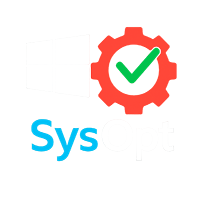
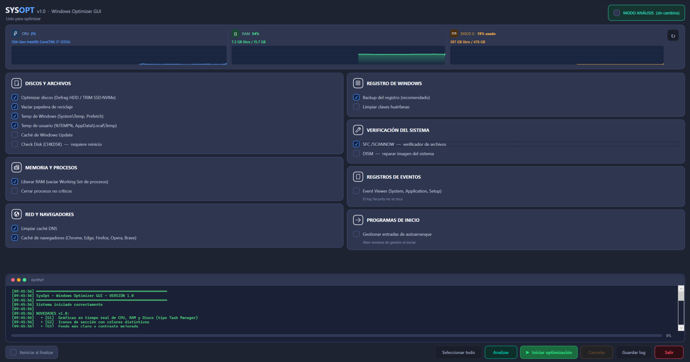
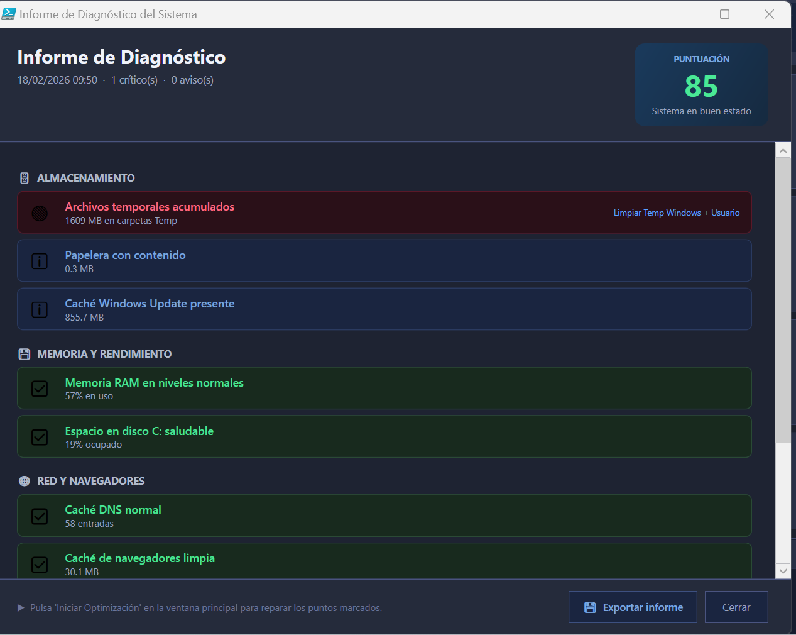
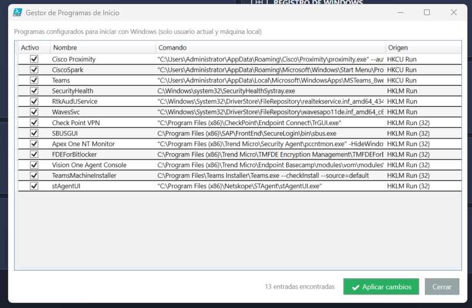

#  SysOpt v3.2.0 (STABLE) — Windows System Optimizer (Español)
**Script PowerShell con interfaz gráfica — `SysOpt.ps1`**

> **Nota de versión:** La versión en desarrollo activa es **v3.2.0-STABLE**, que incluye 68 temas visuales, soporte multiidioma (ES/EN/PT-BR), ventana de opciones con toggle Win11, CancellationToken global, Data Access Layer, Agent hooks, notificaciones Toast temáticas, Easter Egg Breakout, y **10 DLLs modulares** (Core, ThemeEngine, DiskEngine, MemoryHelper, WseTrim, Optimizer, StartupManager, Diagnostics, Toast, Breakout). La última versión pública estable es **v2.5.0**.

Este proyecto implementa un **optimizador avanzado para Windows**, desarrollado íntegramente en **PowerShell** y utilizando una interfaz gráfica basada en **WPF/XAML**. Permite ejecutar tareas de mantenimiento, limpieza, verificación y optimización del sistema desde una única ventana, con monitorización de recursos en tiempo real, barra de progreso, consola integrada y modo de análisis sin cambios.

---

## 📸 Vista previa de la interfaz



---

## 🚀 Funcionalidades principales

### 🗄️ Discos y Archivos
- Optimización automática según tipo de disco:
  - **SSD → TRIM**
  - **HDD → Desfragmentación**
- Vaciar papelera de reciclaje en todas las unidades
- Eliminar archivos temporales de Windows (`System\Temp`, `Prefetch`)
- Eliminar archivos temporales del usuario (`%TEMP%`, `AppData\Local\Temp`)
- Limpiar caché de **Windows Update** (`SoftwareDistribution\Download`)
- Programar **CHKDSK /F /R** para el próximo reinicio

### 🔍 Explorador de Disco

Escáner de carpetas estilo **TreeSize**: analiza de forma recursiva y paralela cualquier unidad o directorio y muestra el uso real de disco por carpeta con barras visuales proporcionales, permitiendo identificar de un vistazo qué ocupa más espacio.


- Escaneo recursivo paralelo con **ParallelScanner** (C# inline)
- Árbol de carpetas con tamaños, porcentajes y barras visuales proporcionales
- **Colapsar y expandir carpetas** sin bloqueo de UI (childMap cacheado, DFS con frame stack)
- **Filtro en tiempo real** por nombre de carpeta
- **Menú contextual** oscuro temático: abrir, copiar ruta, escanear subcarpeta, eliminar
- **Exportar a CSV** con `StreamWriter` directo (sin materializar el CSV en RAM)
- **Exportar a HTML** con informe visual completo (async, con barra de progreso) — genera un documento navegable con la jerarquía de carpetas, tamaños y colores codificados por uso
- **Explorador de archivos** por carpeta — escaneo streaming con `ConcurrentQueue`, filtro, ordenación y eliminación directa
- Memoria adaptativa según RAM libre (BATCH + intervalo de timer ajustados automáticamente)

### 📸 Historial de Escaneos (Snapshots)

La ventana de snapshots permite **guardar y cargar el estado completo de cualquier escaneo** como archivo JSON. Al abrir la lista de snapshots se muestran solo los metadatos (nombre, fecha, número de carpetas y tamaño total) sin cargar los entries en RAM — la carga de datos se produce únicamente al seleccionar un snapshot concreto.


- **Guardar** el estado del escaneo actual como snapshot JSON con nombre personalizable
- **Lista de snapshots** cargada en background sin bloquear la UI (solo metadatos vía streaming)
- **Cargar snapshot**: restaura la vista del explorador con los datos guardados
- **Comparar escaneos**: detecta carpetas nuevas, eliminadas y cambios de tamaño entre dos estados del sistema — soporta tres modos:
  - Snapshot vs escaneo actual cargado
  - Snapshot A vs Snapshot B (comparación histórica entre dos fechas)
- Selección múltiple con checkboxes, botón "Todo" para marcar/desmarcar en lote
- Eliminación en lote con confirmación
- Comparador O(1) con `HashSet<string>` + `Dictionary<string,long>` (sin iteraciones cuadráticas)

### 📊 Pestaña Rendimiento

Monitorización en tiempo real del sistema al estilo Task Manager, con gráficas actualizadas automáticamente.


- **CPU**: porcentaje de uso con gráfica histórica
- **RAM**: uso actual y disponible en tiempo real
- **Disco**: actividad de lectura/escritura
- **Red**: velocidad de subida y bajada en tiempo real, con detección de tipo de interfaz (Ethernet 🔌 / WiFi 📶)
- **SMART del disco**: estado de salud del disco principal
- **Auto-refresco configurable**: intervalos de 5, 15, 30 y 60 segundos

### 💾 Memoria y Procesos
- Liberar RAM real mediante **EmptyWorkingSet** (Win32 API nativa)
- Cerrar procesos no críticos (opcional)

### 🌐 Red y Navegadores
- Limpiar caché DNS
- Limpiar caché de navegadores: **Chrome, Firefox (cache + cache2), Edge, Opera, Opera GX, Brave**

### 📋 Registro de Windows
- Crear copia de seguridad del registro (requerida antes de limpiar)
- Buscar y limpiar claves huérfanas

### 🔧 Verificación del Sistema
- Ejecutar **SFC /SCANNOW**
- Ejecutar **DISM /RestoreHealth**

### 📋 Registros de Eventos
- Limpiar logs de **Event Viewer**: System, Application, Setup
- El log de Seguridad no se modifica

### 🔍 Modo Análisis (Dry Run)
Ejecuta un análisis completo del sistema **sin realizar ningún cambio**. Genera un informe de diagnóstico con puntuación de salud del sistema, detectando problemas críticos y avisos.



> *Informe de Diagnóstico con puntuación del sistema, detalle por categorías y opción de exportar.*

### 🚀 Gestión de Programas de Inicio
Ventana dedicada para **ver y gestionar las entradas de autoarranque** de Windows (HKCU Run y HKLM Run). Permite activar o desactivar programas de inicio sin necesidad de herramientas externas.



### 📟 Consola integrada
- Registro detallado de cada acción con timestamps automáticos
- Indicador de progreso con porcentaje exacto y tarea actual
- Aviso antes de limpiar la consola si contiene contenido

---

## 🖥️ Interfaz gráfica (GUI)

Construida en XAML, incluye:

- **Panel de recursos en tiempo real** — gráficas de CPU, RAM y Disco tipo Task Manager
- Estilos personalizados para botones, checkboxes y grupos con colores distintivos por sección
- Scroll automático para listas largas
- Consola estilo terminal con colores tipo PowerShell
- Barra de progreso con gradiente y porcentaje exacto
- **Diálogo de progreso con botón "Segundo plano"** para exportaciones y cargas largas
- **Sistema de temas completo** — 68 temas intercambiables en runtime con cobertura total de la UI
- **Soporte multiidioma** — ES, EN, PT-BR con cambio en caliente sin reiniciar
- **Ventana de opciones** para personalizar tema, idioma y debug (toggle Win11)
- Opción de reinicio automático al finalizar
- Protección contra doble ejecución simultánea (Mutex global)

---


### 🎨 Sistema de Temas

Motor de temas completo que permite cambiar la apariencia visual de toda la aplicación en tiempo real. Incluye 68 temas preinstalados con paletas de colores distintas.

- **68 temas incluidos**: Default, Default Light, Ice Blue, Ice Cream, Manga Japan, Matrix, PipBoy, Simpsons, Votorantim, Windows, Windows Light, y 57 temas adicionales (gaming, tech, diseño)
- **Tematización dual**: XAML principal via `{DynamicResource}` + UI dinámica via `Get-TC` (298 llamadas)
- **Cobertura total**: barras de progreso, badges de estado, iconos, ComboBox dropdowns, gradientes, diálogos y 8 ventanas dinámicas
- **Archivos `.theme`** externos en `.\assets\themes\` — formato clave=valor fácil de editar
- **SysOpt.ThemeEngine.dll** — parser de temas compilado en C# para carga rápida
- **Barra de progreso** al cargar un tema (hilo en segundo plano)
- **Persistencia automática** — el tema seleccionado se guarda en `%APPDATA%\SysOpt\settings.json`

### 🌐 Sistema Multiidioma (i18n)

Soporte completo de internacionalización con archivos de idioma externos y aplicación inmediata sin reiniciar.

- **3 idiomas incluidos**: Español (es-es), English (en-us), Português (pt-br)
- **Archivos `.lang`** externos en `.\assets\lang\` — formato clave=valor editable
- **LangEngine** en `SysOpt.Core.dll` — parser de idiomas compilado en C#
- **Actualización inmediata** de todos los textos de la UI al cambiar idioma
- **Persistencia automática** — el idioma seleccionado se guarda en settings.json
- **Detección de idiomas disponibles** al abrir la ventana de opciones

### ⚙️ Ventana de Opciones

Panel unificado con **3 secciones de navegación**: Configuración, Tareas y Acerca de. El botón "About" independiente fue eliminado del header y su contenido migrado aquí.

- **Sección Configuración** — Selector de tema, selector de idioma, toggle debug Win11, toggle notificaciones Toast
- **Sección Tareas** — Panel de operaciones async en segundo plano
- **Sección Acerca de** — Logo de la app, versión, desarrollador, changelog y Easter Egg (4 clicks en logo)
- **Selector de tema** — ComboBox con todos los temas disponibles, aplicación inmediata
- **Selector de idioma** — ComboBox con todos los idiomas disponibles, aplicación inmediata
- **Toggle debug Win11** — switch estilo Windows 11 (50×26px) con anti-aliasing, usa colores del tema activo
- **ComboBox tematizados** — los dropdowns del selector también cambian con el tema activo (popup, items, texto)

---

## 🏗️ Arquitectura Modular — 10 DLLs

SysOpt externaliza lógica pesada en DLLs compiladas en C# para mejor rendimiento y mantenibilidad:

| DLL | Funcionalidad | Namespace |
|-----|---------------|-----------|
| `SysOpt.Core.dll` | LangEngine, CoreUtils, ScanTokenManager, SystemDataCollector, AgentBus | `SysOpt.Core` |
| `SysOpt.ThemeEngine.dll` | Parser de temas, gestión de paletas | `SysOpt.ThemeEngine` |
| `SysOpt.DiskEngine.dll` | DiskItem, ParallelScanner, TreeView data | `SysOpt.DiskEngine` |
| `SysOpt.MemoryHelper.dll` | EmptyWorkingSet via Win32 API | `SysOpt.MemoryHelper` |
| `SysOpt.WseTrim.dll` | Working Set trimming batch | `SysOpt.WseTrim` |
| `SysOpt.Optimizer.dll` | 15 tareas de optimización del sistema | `SysOpt.Optimizer` |
| `SysOpt.StartupManager.dll` | Gestión de programas de inicio (HKCU/HKLM) | `SysOpt.StartupManager` |
| `SysOpt.Diagnostics.dll` | Motor de diagnóstico con 9 métricas | `SysOpt.Diagnostics` |
| `SysOpt.Toast.dll` | Notificaciones Toast temáticas WPF (4 tipos) | `SysOpt.Toast` |
| `SysOpt.Breakout.dll` | Easter Egg — Atari Breakout (DrawingVisual 60fps) | `SysOpt.Breakout` |

Las DLLs se cargan secuencialmente en el splash con indicadores de progreso (10%→59%) y se auditan en el debug log.

### Compilación de DLLs

```powershell
cd libs\csproj
.\compile-dlls.ps1
```

El script auto-descubre todos los `.cs` en `.\libs\csproj\` y los compila con las referencias inter-DLL correctas. Incluye detección automática de referencias WPF para `SysOpt.Breakout.cs` (PresentationFramework, PresentationCore, WindowsBase).

---

## 🔐 Requisitos

- Windows 10/11
- PowerShell 5.1 o superior
- .NET Framework 4.x
- **Debe ejecutarse como Administrador**

El script valida automáticamente los permisos de administrador al iniciar.

---

## ▶️ Ejecución

### Opción A — Ejecutable directo (`.exe`) ✅ Recomendado
No requiere PowerShell ni cambiar políticas de ejecución. Simplemente haz clic derecho sobre `SysOpt.exe` y selecciona **"Ejecutar como administrador"**.

### Opción B — Script PowerShell (`.ps1`)

1. Abrir PowerShell **como Administrador**
2. Ejecutar el script:
   ```powershell
   .\SysOpt.ps1
   ```

> Es posible que haya que cambiar la política de ejecución de PowerShell:
> ```powershell
> Set-ExecutionPolicy -ExecutionPolicy Bypass -Scope LocalMachine
> ```

---

## 📝 Historial de cambios

### v3.2.0 (STABLE)

#### CTK + DAL + Agent Hooks + 3 DLLs Nuevas

- **[CTK]** `ScanTokenManager` — CancellationToken global que reemplaza el flag `ScanCtl211.Stop`. Métodos `RequestNew()`, `Cancel()` y `Dispose()` en `Add_Closed` para cancelación limpia de runspaces.
- **[DAL]** `SystemDataCollector` — `GetCpuSnapshot` / `GetRamSnapshot` / `GetDiskSnapshot` / `GetNetworkSnapshot` / `GetGpuSnapshot` / `GetPortSnapshot`. `GetFullSnapshot()` devuelve `SystemSnapshot` completo serializable para modo agente.
- **[DAL]** Modelos puros: `CpuSnapshot`, `RamSnapshot`, `DiskSnapshot`, `NetworkSnapshot`, `GpuSnapshot`, `PortSnapshot`.
- **[AGENT]** `AgentBus` + `IAgentTransport` + `AgentThresholds` — hooks preparados, standalone safe.
- **[DLL]** `SysOpt.Optimizer.dll` — 15 tareas de optimización en C# (limpieza, TRIM, defrag, DNS, etc.).
- **[DLL]** `SysOpt.StartupManager.dll` — gestión de programas de inicio de Windows (HKCU/HKLM Run).
- **[DLL]** `SysOpt.Diagnostics.dll` — motor de diagnóstico del sistema con 9 métricas y scoring.
- **[DLL]** `compile-dlls.ps1` renovado — auto-descubre todos los `.cs` de `.\libs\csproj\` con referencias cruzadas.
- **[DLL]** `Load-SysOptDll` helper unificado — un punto de carga para las 10 DLLs.
- **[DLL]** WseTrim cargado al inicio (junto al resto) en lugar de bajo demanda.
- **[THEME]** Expansión de 11 a **68 temas** preinstalados (+57 nuevos: gaming, tech, diseño).
- **[UI]** Toggle switch estilo Win11 en ventana de opciones (50×26px, anti-aliased, colores del tema activo).
- **[UI]** Sección "Acerca de" migrada a OptionsWindow (3 secciones: Config/Tasks/About). Botón About eliminado del header.
- **[UI]** Reordenación de botones: Tasks → posición config, Options → posición anterior de About.
- **[DLL]** `SysOpt.Toast.dll` — notificaciones toast temáticas WPF (4 tipos: Success/Info/Warning/Error, sincronización con tema activo).
- **[DLL]** `SysOpt.Breakout.dll` — Easter Egg Atari Breakout con DrawingVisual 60fps en proceso aislado.
- **[I18N]** 54 keys por idioma, 32 strings de `Diagnostics.cs` localizados con `Loc.T()`.
- **[DBG]** Auditoría ampliada a **10 DLLs** en debug log y splash con progreso monotónico.
- **[FIX]** Cierre completo: disposal de 6 contextos async + `[Environment]::Exit(0)` para eliminar procesos zombie.
- **[DATA]** `SysOpt.info` — `$AppNotes` externalizado con formato box-drawing beautificado.
- **[EGG]** Easter Egg: Atari Breakout oculto (4 clicks en logo About), DrawingVisual renderer, proceso aislado 60fps.
- **[OPT]** PS1 reducido de 6,924 a 6,243 líneas (−681, −9.8%) mediante externalización a DLLs + compactación (`$taskMap`, reflexión `$diagHash`).
- **[FIX]** Todas las funciones públicas (73) convertidas a `global:` scope para compatibilidad con handlers WPF.
- **[FIX]** `StartupEntry.Location` → `StartupEntry.RegPath` — propiedad alineada con la clase C#.
- **[FIX]** Barra de progreso de optimización: `OptimizeProgress.Percent` default = −1 (ignora callbacks sin progreso explícito).
- **[FIX]** Barra de splash: secuencia monotónica (nunca retrocede) con protección anti-retroceso.

---

### v3.1.0 (Dev)

#### Temas visuales + Internacionalización + DLLs modulares

- **[THEME]** Motor de temas completo con estrategia dual: `{DynamicResource}` para XAML principal (293 bindings) + `Get-TC` para UI dinámica (298 llamadas). Cobertura de 111 de 115 colores XAML.
- **[THEME]** 11 temas preinstalados en `.\assets\themes\`: Default, Default Light, Ice Blue, Ice Cream, Manga Japan, Matrix, PipBoy, Simpsons, Votorantim, Windows, Windows Light.
- **[THEME]** Tematización completa de ComboBox: `Apply-ComboBoxDarkTheme` con hook `DropDownOpened` para popup, items y texto del selector.
- **[THEME]** Barras de progreso, badges de estado, iconos y 8 ventanas dinámicas tematizadas con `Get-TC` + `Update-DynamicThemeValues`.
- **[THEME]** `SysOpt.ThemeEngine.dll` — parser C# para archivos `.theme` (clave=valor).
- **[I18N]** Sistema multiidioma con 3 idiomas: Español (es-es), English (en-us), Português (pt-br).
- **[I18N]** Archivos `.lang` externos en `.\assets\lang\` con `LangEngine` (C# en `SysOpt.Core.dll`).
- **[I18N]** Actualización inmediata de todos los textos UI al cambiar idioma (sin reinicio).
- **[DLL]** `SysOpt.Core.dll` — LangEngine + SettingsHelper compilados como ensamblado externo.
- **[DLL]** `SysOpt.ThemeEngine.dll` — ThemeParser compilado como ensamblado externo.
- **[UI]** Ventana de Opciones con selectores de tema e idioma entre botones Tareas y Acerca de.
- **[UI]** Símbolo `©` en la ventana Acerca de (reemplaza `(c)`).
- **[UI]** Metadatos de versión actualizados: muestra solo versión actual + 3 anteriores.
- **[SETTINGS]** Persistencia de tema e idioma en `%APPDATA%\SysOpt\settings.json`.
- **[SETTINGS]** Flujo de inicio corregido: `Load-Settings` → `Load-Language` → `Apply-Theme` dentro de `Add_Loaded`.
- **[FIX]** `Invoke-CimQuery` copiada al runspace de liberación de RAM para evitar error de función no encontrada.
- **[FIX]** Barras de progreso en Tasks: conversión explícita de string hex a `SolidColorBrush` objects.
- **[FIX]** Texto de ComboBox: `Foreground` establecido con color `TextPrimary` del tema activo.

---

### v3.0.0 (Dev)

#### DLL externos nativos — Arquitectura modular

- **[DLL]** `SysOpt.MemoryHelper.dll` y `SysOpt.DiskEngine.dll` compilados como ensamblados externos en `.\libs\`. Se cargan con `Add-Type -Path` al inicio — elimina la recompilación inline C# por sesión.
- **[DLL]** Guard de tipo compartido aplicado a todos los tipos C#: `DiskItem_v211`, `DiskItemToggle_v230`, `ScanCtl211` y `PScanner211` nunca se recompilan aunque el script se relance en la misma sesión de PowerShell.
- **[DLL]** `MemoryHelper.EmptyWorkingSet` disponible desde el primer frame de arranque, sin bloque `Add-Type` inline.
- **[ARCH]** Ruta de libs normalizada a `.\libs\` relativa al script (`$PSScriptRoot`). Mensaje de error descriptivo si falta algún ensamblado.

---

### v2.5.0 *(versión pública estable)*

#### Estabilidad, Deduplicación y TaskPool

- **[LOG]** Logging estructurado a archivo rotante diario: `Write-Log` centralizado escribe a la UI y a `.\logs\SysOpt_YYYY-MM-DD.log` con rotación automática por día. Thread-safe mediante Mutex de nombre. `Write-ConsoleMain` es ahora alias de `Write-Log` (100% compatible).
- **[ERR]** Error boundary global: `AppDomain.UnhandledException` captura excepciones de runspaces en background; `Dispatcher.UnhandledException` captura errores del hilo WPF. Ambos logean el error y muestran un diálogo amigable en lugar de crash.
- **[WMI]** `CimSession` compartida con timeout de 5 s: `Invoke-CimQuery` reemplaza todos los `Get-CimInstance` directos del hilo UI. Si WMI tarda más de 5 s el timeout evita que la UI se congele, y la sesión se recrea automáticamente si falla.
- **[B5]** Deduplicación SHA256 para archivos >10 MB: botón "🔍 Duplicados" en la barra del Explorador de Disco. Hash calculado en runspace background — la UI nunca bloquea. Ventana de resultados con grupos, espacio recuperable y eliminación de copias.
- **[TASKPOOL]** Pestaña "⚡ Tareas" — panel de operaciones en segundo plano: todas las operaciones async (escaneo, CSV, HTML, dedup) se registran con barra de progreso responsive, badge de estado y tiempo transcurrido. Botón "Limpiar completadas" para purgar el historial. Timer de refresco de 1 s — impacto cero en UI.

#### Bugs corregidos
- **Fix `FrameworkElementFactory`**: reemplazado por XAML string en `Show-TasksWindow` (eliminadas 254 líneas obsoletas).
- **Fix race condition `Split-Path`**: null-guard añadido cuando `Result` llega antes que `Done` en la hashtable sincronizada.
- **Fix botones historial en blanco**: los botones Guardar, Comparar y Eliminar del panel de snapshots ahora usan los estilos temáticos (`BtnSecondary`, `BtnPrimary`, `BtnDanger`) en lugar de colores hardcodeados, lo que respeta correctamente el tema en todos los estados (normal, hover, disabled).
- **Fix timers async**: los 6 timers async (csv/html/dedup/load/ent/save) ahora se detienen limpiamente en `Add_Closed`.

---

### v2.4.0 *(integrada en v2.5.0)*

#### Optimizaciones FIFO de RAM
- **[FIFO-01]** Guardado de snapshot con `ConcurrentQueue` + `StreamWriter` directo al disco. El hilo UI encola items uno a uno mientras el background los drena y escribe en paralelo — el JSON completo nunca existe en RAM. Ahorro: −50% a −200% RAM pico.
- **[FIFO-02]** Carga de entries con `ConvertFrom-Json` nativo + `ConcurrentQueue`. Eliminada la dependencia de `Newtonsoft.Json` en runspaces background (no se hereda en PS 5.1). Los entries se encolan uno a uno. `DispatcherTimer` drena en lotes de 500/tick.
- **[FIFO-03]** Terminación limpia garantizada: liberación de streams + GC agresivo con LOH compaction en bloque `finally`, incluso en caso de error.

#### Bugs corregidos
- **Fix `Set-Content` → `File::WriteAllText`** en `Save-Settings`: evita el error "Stream was not readable" en PS 5.1 con StreamWriters activos en paralelo.
- **Fix toggle colapsar/expandir carpetas**: `LiveList` es `List<T>`, no `ObservableCollection` — WPF no detecta `Clear()/Add()` sin `lbDiskTree.Items.Refresh()` explícito.
- **Fix parser FIFO-02**: el parser de regex manual era frágil con variaciones de whitespace de `ConvertTo-Json`. Reemplazado por `ConvertFrom-Json` nativo, robusto y compatible con snapshots v2.3 y v2.4.0.

---

### v2.3.0

#### Optimizaciones de RAM
- **[RAM-01]** `DiskItem_v211` sin `INotifyPropertyChanged`. Toggle extraído a `DiskItemToggle_v230` (wrapper INPC ligero que no retiene event listeners en los miles de items).
- **[RAM-02]** Exportación CSV con `StreamWriter` directo y flush cada 500 items (sin `StringBuilder`). Exportación HTML con `StreamWriter` a archivo temporal para las filas.
- **[RAM-03]** `AllScannedItems` pasado por referencia al runspace via hashtable sincronizada compartida — sin clonar la colección completa.
- **[RAM-04]** `Load-SnapshotList` con `JsonTextReader` línea a línea — los arrays `Entries` nunca se deserializan al listar snapshots. Ahorro: −200 a −400 MB pico.
- **[RAM-05]** `RunspacePool` centralizado (1–3 runspaces, `InitialSessionState.CreateDefault2()`) para todas las operaciones async.
- **[RAM-06]** GC agresivo post-operación: LOH compaction + `EmptyWorkingSet` tras exportaciones y cargas de snapshot.

#### Nuevas funciones
- Snapshots con selección por checkboxes, botón "Todo" y contador en tiempo real
- Comparador en 3 modos: snapshot vs actual, snapshot A vs B, histórico
- Eliminación en lote de snapshots con confirmación
- Comparador O(1) con `HashSet<string>` + `Dictionary<string,long>` (antes O(n²))
- Debounce 80ms en `Refresh-DiskView` para evitar rebuilds múltiples en ráfagas del scanner

#### Bugs corregidos
- Ruta de snapshots cambiada a `.\snapshots\` relativo al script
- Fix en clave de hashtable de `Load-SnapshotList` que impedía listar snapshots
- Fix consumo RAM al listar snapshots (solo metadatos, entries bajo demanda)
- Fix diálogo de confirmación: escape de comillas dobles en nombres con caracteres especiales

---

### v2.2.0

- Explorador de archivos por carpeta (escaneo streaming, filtro, ordenación, eliminación)
- Exportación HTML con informe visual
- Filtro en tiempo real en el árbol de carpetas
- Menú contextual temático oscuro
- Persistencia de configuración en JSON (`%APPDATA%\SysOpt\settings.json`)
- Auto-refresco configurable en pestaña Rendimiento
- Snapshots de escaneo con historial async y barra de progreso

---

### v2.1.x

- Fix colapso de carpetas sin bloqueo de UI (childMap cacheado)
- BATCH y timer adaptativos según RAM libre
- DFS con frame stack para orden garantizado
- Fix `Array::Sort` → `Sort-Object` correcto
- Fix parser: backtick multilínea en `.AddParameter`
- Fix "Token 'if' inesperado" en argumento de método

---

### v2.0.x

- `EmptyWorkingSet` real via Win32 API (liberación de RAM efectiva)
- `CleanRegistry` exige `BackupRegistry` previo
- Mutex con `AbandonedMutexException` manejada
- Detección de SSD por `DeviceID`
- Rutas completas de Opera / Opera GX / Brave / Firefox (cache + cache2)
- Panel de información del sistema en tiempo real
- Modo Dry Run con informe de diagnóstico y puntuación
- Limpieza de caché de Windows Update
- Limpieza de logs de Event Viewer
- Gestor de programas de inicio (HKCU/HKLM autorun)

---

---

#  SysOpt v3.2.0 (STABLE) — Windows System Optimizer (English)
**PowerShell Script with Graphical Interface — `SysOpt.ps1`**

> **Version note:** The active development version is **v3.2.0-STABLE**, which adds 68 visual themes, multi-language support (ES/EN/PT-BR), options window with Win11 toggle, global CancellationToken, Data Access Layer, Agent hooks, theme-aware Toast notifications, Easter Egg Breakout, and **10 modular DLLs** (Core, ThemeEngine, DiskEngine, MemoryHelper, WseTrim, Optimizer, StartupManager, Diagnostics, Toast, Breakout). The latest public stable release is **v2.5.0**.

This project provides an **advanced Windows optimization tool**, fully developed in **PowerShell** with a graphical interface built on **WPF/XAML**. It allows you to run maintenance, cleanup, verification, and system optimization tasks from a single window, with real-time resource monitoring, a progress bar, an integrated console, and an analysis mode that makes no changes.

---

## 📸 Interface Preview


---

## 🚀 Main Features

### 🗄️ Disks and Files
- Automatic optimization based on disk type:
  - **SSD → TRIM**
  - **HDD → Defragmentation**
- Empty the recycle bin on all drives
- Delete Windows temporary files (`System\Temp`, `Prefetch`)
- Delete user temporary files (`%TEMP%`, `AppData\Local\Temp`)
- Clean **Windows Update cache** (`SoftwareDistribution\Download`)
- Schedule **CHKDSK /F /R** for the next reboot

### 🔍 Disk Explorer

A **TreeSize-style** folder scanner: recursively and in parallel analyzes any drive or directory and shows actual disk usage per folder with proportional visual bars, making it easy to spot what is taking up the most space at a glance.


- Recursive parallel scan with **ParallelScanner** (inline C#)
- Folder tree with sizes, percentages and proportional visual bars
- **Collapse and expand folders** without UI blocking (cached childMap, DFS with frame stack)
- **Real-time filter** by folder name
- **Dark-themed context menu**: open, copy path, scan subfolder, delete
- **Export to CSV** with direct `StreamWriter` (CSV never materialized in RAM)
- **Export to HTML** with full visual report (async, with progress bar) — generates a navigable document with the folder hierarchy, sizes and colour-coded usage
- **File explorer** per folder — streaming scan with `ConcurrentQueue`, filter, sort and direct deletion
- Adaptive memory usage based on free RAM (BATCH + timer interval auto-adjusted)

### 📸 Scan History (Snapshots)

The snapshot window lets you **save and load the complete state of any scan** as a JSON file. Opening the snapshot list shows only metadata (name, date, folder count, total size) without loading entries into RAM — data is only read when you select a specific snapshot.


- **Save** the current scan state as a named JSON snapshot
- **Snapshot list** loaded in background without blocking the UI (metadata-only streaming)
- **Load snapshot**: restores the explorer view with the saved data
- **Compare scans**: detects new folders, deleted folders and size changes between two system states — supports three modes:
  - Snapshot vs current loaded scan
  - Snapshot A vs Snapshot B (historical comparison between two dates)
- Multi-select with checkboxes, "All" button to check/uncheck in bulk
- Batch deletion with confirmation
- O(1) comparator using `HashSet<string>` + `Dictionary<string,long>` (no quadratic iteration)

### 📊 Performance Tab

Real-time system monitoring in the style of Task Manager, with automatically refreshing charts.


- **CPU**: usage percentage with historical chart
- **RAM**: current usage and available memory in real time
- **Disk**: read/write activity
- **Network**: upload and download speed in real time, with interface type detection (Ethernet 🔌 / WiFi 📶)
- **Disk SMART**: health status of the primary drive
- **Configurable auto-refresh**: intervals of 5, 15, 30 and 60 seconds

### 💾 Memory and Processes
- Release RAM using the native **EmptyWorkingSet** Win32 API call
- Close non-critical processes (optional)

### 🌐 Network and Browsers
- Clear DNS cache
- Clear browser cache: **Chrome, Firefox (cache + cache2), Edge, Opera, Opera GX, Brave**

### 📋 Windows Registry
- Create a registry backup (required before cleaning)
- Search and clean orphaned registry keys

### 🔧 System Verification
- Run **SFC /SCANNOW**
- Run **DISM /RestoreHealth**

### 📋 Event Logs
- Clear **Event Viewer** logs: System, Application, Setup
- The Security log is never touched

### 🔍 Analysis Mode (Dry Run)
Runs a full system scan **without making any changes**. Generates a diagnostic report with a system health score, flagging critical issues and warnings.


### 🚀 Startup Program Manager
A dedicated window to **view and manage Windows startup entries** (HKCU Run and HKLM Run), letting you enable or disable programs at boot without any external tools.


### 📟 Integrated Console
- Detailed action log with automatic timestamps
- Progress indicator with exact percentage and current task
- Warning prompt before clearing the console if it has content

---

## 🖥️ Graphical Interface (GUI)

Built using XAML, featuring:

- **Real-time resource panel** — CPU, RAM, and Disk charts similar to Task Manager
- Custom styles for buttons, checkboxes, and group boxes with distinctive section colors
- Auto-scroll for long lists
- Terminal-style console with PowerShell-like colors
- Gradient progress bar with exact percentage
- **Progress dialog with "Background" button** for long exports and snapshot loads
- **Complete theme system** — 68 swappable themes at runtime with full UI coverage
- **Multi-language support** — ES, EN, PT-BR with hot-swap without restart
- **Options window** to customize theme, language and debug mode (Win11 toggle)
- Optional automatic restart when finished
- Protection against simultaneous double execution (global Mutex)

---


### 🎨 Theme System

Complete theme engine that allows changing the entire application's visual appearance in real time. Includes 68 pre-installed themes with distinct color palettes.

- **68 included themes**: Default, Default Light, Ice Blue, Ice Cream, Manga Japan, Matrix, PipBoy, Simpsons, Votorantim, Windows, Windows Light, and 57 additional themes (gaming, tech, design)
- **Dual theming strategy**: main XAML via `{DynamicResource}` + dynamic UI via `Get-TC` (298 calls)
- **Full coverage**: progress bars, status badges, icons, ComboBox dropdowns, gradients, dialogs and 8 dynamic windows
- **External `.theme` files** in `.\assets\themes\` — easy-to-edit key=value format
- **SysOpt.ThemeEngine.dll** — compiled C# theme parser for fast loading
- **Progress bar** shown when loading a theme (background thread)
- **Automatic persistence** — selected theme saved to `%APPDATA%\SysOpt\settings.json`

### 🌐 Multi-Language System (i18n)

Complete internationalization support with external language files and instant application without restart.

- **3 included languages**: Español (es-es), English (en-us), Português (pt-br)
- **External `.lang` files** in `.\assets\lang\` — editable key=value format
- **LangEngine** in `SysOpt.Core.dll` — compiled C# language parser
- **Instant update** of all UI text when changing language
- **Automatic persistence** — selected language saved to settings.json
- **Automatic detection** of available languages when opening options window

### ⚙️ Options Window

Unified panel with **3 navigation sections**: Settings, Tasks, and About. The standalone "About" button was removed from the header and its content migrated here.

- **Settings section** — Theme selector, language selector, Win11 debug toggle, Toast notifications toggle
- **Tasks section** — Background async operations panel
- **About section** — App logo, version, developer, changelog, and Easter Egg (4 clicks on logo)
- **Theme selector** — ComboBox listing all available themes, instant application
- **Language selector** — ComboBox listing all available languages, instant application
- **Win11 debug toggle** — Windows 11–style switch (50×26px) with anti-aliasing, uses active theme colors
- **Themed ComboBoxes** — selector dropdowns also change with the active theme (popup, items, text)

---

## 🏗️ Modular Architecture — 10 DLLs

SysOpt externalizes heavy logic into compiled C# DLLs for better performance and maintainability:

| DLL | Functionality | Namespace |
|-----|---------------|-----------|
| `SysOpt.Core.dll` | LangEngine, CoreUtils, ScanTokenManager, SystemDataCollector, AgentBus | `SysOpt.Core` |
| `SysOpt.ThemeEngine.dll` | Theme parser, palette management | `SysOpt.ThemeEngine` |
| `SysOpt.DiskEngine.dll` | DiskItem, ParallelScanner, TreeView data | `SysOpt.DiskEngine` |
| `SysOpt.MemoryHelper.dll` | EmptyWorkingSet via Win32 API | `SysOpt.MemoryHelper` |
| `SysOpt.WseTrim.dll` | Working Set trimming batch | `SysOpt.WseTrim` |
| `SysOpt.Optimizer.dll` | 15 system optimization tasks | `SysOpt.Optimizer` |
| `SysOpt.StartupManager.dll` | Startup program management (HKCU/HKLM Run) | `SysOpt.StartupManager` |
| `SysOpt.Diagnostics.dll` | Diagnostics engine with 9 metrics | `SysOpt.Diagnostics` |
| `SysOpt.Toast.dll` | Theme-aware WPF Toast notifications (4 types) | `SysOpt.Toast` |
| `SysOpt.Breakout.dll` | Easter Egg — Atari Breakout (DrawingVisual 60fps) | `SysOpt.Breakout` |

DLLs are loaded sequentially during splash with progress indicators (10%→59%) and audited in the debug log.

### DLL Compilation

```powershell
cd libs\csproj
.\compile-dlls.ps1
```

The script auto-discovers all `.cs` files in `.\libs\csproj\` and compiles them with correct cross-DLL references. Includes automatic WPF reference detection for `SysOpt.Breakout.cs` (PresentationFramework, PresentationCore, WindowsBase).

---

## 🔐 Requirements

- Windows 10/11
- PowerShell 5.1 or later
- .NET Framework 4.x
- **Must be run as Administrator**

The script automatically validates administrator permissions on startup.

---

## ▶️ How to Run

### Option A — Direct Executable (`.exe`) ✅ Recommended
No PowerShell required, no execution policy changes needed. Simply right-click `SysOpt.exe` and select **"Run as administrator"**.

### Option B — PowerShell Script (`.ps1`)

1. Open PowerShell **as Administrator**
2. Execute the script:
   ```powershell
   .\SysOpt.ps1
   ```

> You may need to change the PowerShell execution policy first:
> ```powershell
> Set-ExecutionPolicy -ExecutionPolicy Bypass -Scope LocalMachine
> ```

---

## 📝 Changelog

### v3.2.0 (STABLE)

#### CTK + DAL + Agent Hooks + 3 New DLLs

- **[CTK]** `ScanTokenManager` — global CancellationToken replacing `ScanCtl211.Stop` flag. `RequestNew()`, `Cancel()` and `Dispose()` in `Add_Closed` for clean runspace cancellation.
- **[DAL]** `SystemDataCollector` — `GetCpuSnapshot` / `GetRamSnapshot` / `GetDiskSnapshot` / `GetNetworkSnapshot` / `GetGpuSnapshot` / `GetPortSnapshot`. `GetFullSnapshot()` returns a fully serializable `SystemSnapshot` for agent mode.
- **[DAL]** Pure models: `CpuSnapshot`, `RamSnapshot`, `DiskSnapshot`, `NetworkSnapshot`, `GpuSnapshot`, `PortSnapshot`.
- **[AGENT]** `AgentBus` + `IAgentTransport` + `AgentThresholds` — prepared hooks, standalone safe.
- **[DLL]** `SysOpt.Optimizer.dll` — 15 system optimization tasks in C# (cleanup, TRIM, defrag, DNS, etc.).
- **[DLL]** `SysOpt.StartupManager.dll` — Windows startup program management (HKCU/HKLM Run).
- **[DLL]** `SysOpt.Diagnostics.dll` — system diagnostics engine with 9 metrics and scoring.
- **[DLL]** `compile-dlls.ps1` revamped — auto-discovers all `.cs` files in `.\libs\csproj\` with cross-DLL references.
- **[DLL]** `Load-SysOptDll` unified helper — single loading point for all 10 DLLs.
- **[DLL]** WseTrim loaded at startup (alongside all others) instead of on-demand.
- **[THEME]** Expansion from 11 to **68 pre-installed themes** (+57 new: gaming, tech, design).
- **[UI]** Win11-style toggle switch in options window (50×26px, anti-aliased, active theme colors).
- **[UI]** About section migrated to OptionsWindow (3 sections: Settings/Tasks/About). Standalone About button removed from header.
- **[UI]** Button reorder: Tasks → config position, Options → former About position.
- **[DLL]** `SysOpt.Toast.dll` — theme-aware WPF Toast notifications (4 types: Success/Info/Warning/Error, synced with active theme).
- **[DLL]** `SysOpt.Breakout.dll` — Easter Egg Atari Breakout with DrawingVisual 60fps in isolated process.
- **[I18N]** 54 keys per language, 32 strings from `Diagnostics.cs` localized with `Loc.T()`.
- **[DBG]** Audit expanded to **10 DLLs** in debug log and splash with monotonic progress.
- **[FIX]** Complete exit cleanup: disposal of 6 async contexts + `[Environment]::Exit(0)` to kill zombie processes.
- **[DATA]** `SysOpt.info` — `$AppNotes` externalized with beautified box-drawing format.
- **[EGG]** Easter Egg: Hidden Atari Breakout (4 clicks on About logo), DrawingVisual renderer, isolated 60fps process.
- **[OPT]** PS1 reduced from 6,924 to 6,243 lines (−681, −9.8%) via DLL externalization + compaction (`$taskMap`, reflection-based `$diagHash`).
- **[FIX]** All 73 public functions converted to `global:` scope for WPF event handler compatibility.
- **[FIX]** `StartupEntry.Location` → `StartupEntry.RegPath` — property aligned with C# class.
- **[FIX]** Optimization progress bar: `OptimizeProgress.Percent` defaults to −1 (ignores callbacks without explicit progress).
- **[FIX]** Splash progress bar: monotonic sequence (never goes backwards) with anti-regression guard.

---

### v3.1.0 (Dev)

#### Theme System, Multi-Language and Options Window

- **[THEME]** Complete theme engine with dual strategy: `{DynamicResource}` for main XAML (293 bindings) + `Get-TC` for dynamic UI (298 calls). Coverage of 111 out of 115 XAML colors.
- **[THEME]** 11 pre-installed themes in `.\assets\themes\`: Default, Default Light, Ice Blue, Ice Cream, Manga Japan, Matrix, PipBoy, Simpsons, Votorantim, Windows, Windows Light.
- **[THEME]** Complete ComboBox theming: `Apply-ComboBoxDarkTheme` with `DropDownOpened` hook for popup, items and selector text.
- **[THEME]** Progress bars, status badges, icons and 8 dynamic windows themed via `Get-TC` + `Update-DynamicThemeValues`.
- **[THEME]** `SysOpt.ThemeEngine.dll` — C# parser for `.theme` files (key=value format).
- **[I18N]** Multi-language system with 3 languages: Español (es-es), English (en-us), Português (pt-br).
- **[I18N]** External `.lang` files in `.\assets\lang\` with `LangEngine` (C# in `SysOpt.Core.dll`).
- **[I18N]** Instant UI text update when switching language (no restart needed).
- **[DLL]** `SysOpt.Core.dll` — LangEngine + SettingsHelper compiled as external assembly.
- **[DLL]** `SysOpt.ThemeEngine.dll` — ThemeParser compiled as external assembly.
- **[UI]** Options Window with theme and language selectors between Tasks and About buttons.
- **[UI]** `©` symbol in About window (replaces `(c)`).
- **[UI]** Version metadata updated: shows only current version + 3 previous versions.
- **[SETTINGS]** Theme and language persistence in `%APPDATA%\SysOpt\settings.json`.
- **[SETTINGS]** Startup flow fixed: `Load-Settings` → `Load-Language` → `Apply-Theme` inside `Add_Loaded`.
- **[FIX]** `Invoke-CimQuery` copied into RAM liberation runspace to prevent missing function error.
- **[FIX]** Task progress bars: explicit conversion from hex string to `SolidColorBrush` objects.
- **[FIX]** ComboBox text: `Foreground` set with `TextPrimary` color from active theme.

---

### v3.0.0 (Dev)

#### Native External DLLs — Modular Architecture

- **[DLL]** `SysOpt.MemoryHelper.dll` and `SysOpt.DiskEngine.dll` compiled as external assemblies in `.\libs\`. Loaded via `Add-Type -Path` at startup — eliminates per-session inline C# recompilation.
- **[DLL]** Type guard applied to all C# types: `DiskItem_v211`, `DiskItemToggle_v230`, `ScanCtl211` and `PScanner211` are never recompiled even when the script is relaunched in the same PowerShell session.
- **[DLL]** `MemoryHelper.EmptyWorkingSet` available from the first startup frame, without inline `Add-Type` block.
- **[ARCH]** Libs path normalized to `.\libs\` relative to the script (`$PSScriptRoot`). Descriptive error message if any assembly is missing.

---

### v2.5.0 *(public stable release)*

#### Stability, Deduplication and TaskPool

- **[LOG]** Structured logging to daily rotating file: centralized `Write-Log` writes to the UI and to `.\logs\SysOpt_YYYY-MM-DD.log` with automatic daily rotation. Thread-safe via named Mutex. `Write-ConsoleMain` is now an alias for `Write-Log` (100% compatible).
- **[ERR]** Global error boundary: `AppDomain.UnhandledException` catches background runspace exceptions; `Dispatcher.UnhandledException` catches WPF thread errors. Both log the error and show a friendly dialog instead of crashing.
- **[WMI]** Shared `CimSession` with 5 s timeout: `Invoke-CimQuery` replaces all direct `Get-CimInstance` calls from the UI thread. If WMI takes longer than 5 s, the timeout prevents the UI from freezing, and the session is automatically recreated if it dies.
- **[B5]** SHA256 deduplication for files >10 MB: "🔍 Duplicates" button in the Disk Explorer toolbar. Hash calculated in background runspace — UI never blocks. Results window with groups, recoverable space and copy deletion.
- **[TASKPOOL]** "⚡ Tasks" tab — background operations panel: all async operations (scan, CSV, HTML, dedup) are registered with a responsive progress bar, status badge and elapsed time. "Clear completed" button to purge finished tasks. 1 s refresh timer — zero UI impact.

#### Bug Fixes
- **Fix `FrameworkElementFactory`**: replaced with XAML string in `Show-TasksWindow` (254 obsolete lines removed).
- **Fix `Split-Path` race condition**: null-guard added when `Result` arrives before `Done` in the synchronized hashtable.
- **Fix history buttons showing white**: Guardar, Comparar and Eliminar buttons in the snapshot panel now use themed styles (`BtnSecondary`, `BtnPrimary`, `BtnDanger`) instead of hardcoded colors, correctly respecting the theme in all states (normal, hover, disabled).
- **Fix async timers**: all 6 async timers (csv/html/dedup/load/ent/save) now stop cleanly on `Add_Closed`.

---

### v2.4.0 *(merged into v2.5.0)*

#### FIFO RAM Optimizations
- **[FIFO-01]** Snapshot save with `ConcurrentQueue` + `StreamWriter` writing directly to disk. The UI thread enqueues items one by one while the background drains and writes in parallel — the full JSON never exists in RAM. Saving: −50% to −200% RAM peak.
- **[FIFO-02]** Entry loading with native `ConvertFrom-Json` + `ConcurrentQueue`. Removed `Newtonsoft.Json` dependency from background runspaces (not inherited in PS 5.1). Entries enqueued one by one. `DispatcherTimer` drains in batches of 500/tick.
- **[FIFO-03]** Guaranteed clean termination: stream release + aggressive GC with LOH compaction in `finally` block, even on error.

#### Bug Fixes
- **Fix `Set-Content` → `File::WriteAllText`** in `Save-Settings`: prevents "Stream was not readable" error in PS 5.1 with active parallel StreamWriters.
- **Fix folder collapse/expand toggle**: `LiveList` is `List<T>`, not `ObservableCollection` — WPF does not detect `Clear()/Add()` without explicit `lbDiskTree.Items.Refresh()`.
- **Fix FIFO-02 parser**: manual regex parser was fragile with `ConvertTo-Json` whitespace variations. Replaced by native `ConvertFrom-Json`, robust and compatible with v2.3 and v2.4.0 snapshots.

---

### v2.3.0

#### RAM Optimizations
- **[RAM-01]** `DiskItem_v211` without `INotifyPropertyChanged`. Toggle extracted to `DiskItemToggle_v230` (lightweight INPC wrapper that doesn't retain event listeners across thousands of items).
- **[RAM-02]** CSV export with direct `StreamWriter` and flush every 500 items (no `StringBuilder`). HTML export with `StreamWriter` to temp file for table rows.
- **[RAM-03]** `AllScannedItems` passed by reference to runspace via shared synchronized hashtable — no full collection clone.
- **[RAM-04]** `Load-SnapshotList` with line-by-line `JsonTextReader` — `Entries` arrays never deserialized during listing. Saving: −200 to −400 MB peak.
- **[RAM-05]** Centralized `RunspacePool` (1–3 runspaces, `InitialSessionState.CreateDefault2()`) for all async operations.
- **[RAM-06]** Aggressive post-operation GC: LOH compaction + `EmptyWorkingSet` after exports and snapshot loads.

#### New Features
- Snapshots with per-item checkboxes, "All" button and real-time counter
- 3-mode comparator: snapshot vs current, snapshot A vs B, historical
- Batch snapshot deletion with confirmation
- O(1) comparator with `HashSet<string>` + `Dictionary<string,long>` (previously O(n²))
- 80ms debounce on `Refresh-DiskView` to prevent multiple rebuilds during scanner bursts

#### Bug Fixes
- Snapshot path changed to `.\snapshots\` relative to the script
- Fix in `Load-SnapshotList` hashtable key that prevented listing snapshots
- Fix high RAM usage when listing snapshots (metadata only, entries on demand)
- Fix confirmation dialog: escape double quotes in names with special characters

---

### v2.2.0

- File explorer per folder (streaming scan, filter, sort, deletion)
- HTML export with visual report
- Real-time filter in folder tree
- Dark-themed context menu
- Configuration persistence in JSON (`%APPDATA%\SysOpt\settings.json`)
- Configurable auto-refresh on Performance tab
- Scan snapshots with async history and progress bar

---

### v2.1.x

- Fix folder collapse without UI blocking (cached childMap)
- Adaptive BATCH and timer based on free RAM
- DFS with frame stack for guaranteed order
- Fix `Array::Sort` → `Sort-Object`
- Fix parser: multiline backtick in `.AddParameter`
- Fix "unexpected token 'if'" in method argument

---

### v2.0.x

- Real `EmptyWorkingSet` via Win32 API
- `CleanRegistry` requires prior `BackupRegistry`
- Mutex with `AbandonedMutexException` handled
- SSD detection by `DeviceID`
- Full paths for Opera / Opera GX / Brave / Firefox (cache + cache2)
- Real-time system info panel
- Dry Run mode with diagnostic report and health score
- Windows Update cache cleanup
- Event Viewer log cleanup
- Startup program manager (HKCU/HKLM autorun)
