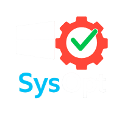
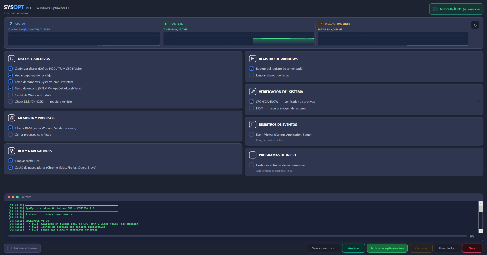
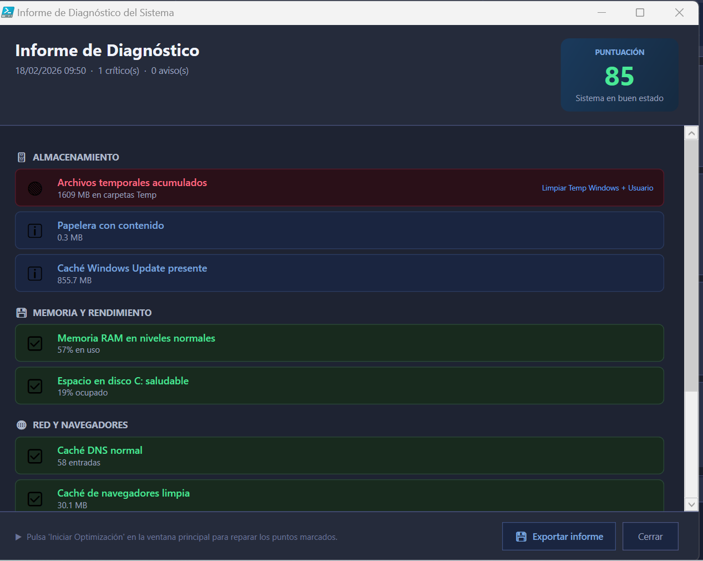

#  SysOpt v1.0 — Windows System Optimizer (Español)
**Script PowerShell con interfaz gráfica — `SysOpt.ps1`**

Este proyecto implementa un **optimizador avanzado para Windows**, desarrollado íntegramente en **PowerShell** y utilizando una interfaz gráfica basada en **WPF/XAML**. Permite ejecutar tareas de mantenimiento, limpieza, verificación y optimización del sistema desde una única ventana, con monitorización de recursos en tiempo real, barra de progreso, consola integrada y modo de análisis sin cambios.

---

## 📸 Vista previa de la interfaz



> *Captura proporcionada por el autor mostrando la ejecución real del script.*

---

## 🚀 Funcionalidades principales

### 🗄️ Discos y Archivos
- Optimización automática según tipo de disco:
  - **SSD → TRIM**
  - **HDD → Desfragmentación**
- Vaciar papelera de reciclaje en todas las unidades
- Eliminar archivos temporales de Windows (`System\Temp`, `Prefetch`)
- Eliminar archivos temporales del usuario (`%TEMP%`, `AppData\Local\Temp`)
- Limpiar caché de **Windows Update** (`SoftwareDistribution\Download`)
- Programar **CHKDSK /F /R** para el próximo reinicio

### 💾 Memoria y Procesos
- Liberar RAM real mediante **EmptyWorkingSet** (Win32 API nativa)
- Cerrar procesos no críticos (opcional)

### 🌐 Red y Navegadores
- Limpiar caché DNS
- Limpiar caché de navegadores: **Chrome, Firefox (cache + cache2), Edge, Opera, Opera GX, Brave**

### 📋 Registro de Windows
- Crear copia de seguridad del registro (requerida antes de limpiar)
- Buscar y limpiar claves huérfanas

### 🔧 Verificación del Sistema
- Ejecutar **SFC /SCANNOW**
- Ejecutar **DISM /RestoreHealth**

### 📋 Registros de Eventos
- Limpiar logs de **Event Viewer**: System, Application, Setup
- El log de Seguridad no se modifica

### 🔍 Modo Análisis (Dry Run)
Ejecuta un análisis completo del sistema **sin realizar ningún cambio**. Genera un informe de diagnóstico con puntuación de salud del sistema, detectando problemas críticos y avisos.



> *Informe de Diagnóstico con puntuación del sistema, detalle por categorías y opción de exportar.*

### 🚀 Gestión de Programas de Inicio
Ventana dedicada para **ver y gestionar las entradas de autoarranque** de Windows (HKCU Run y HKLM Run). Permite activar o desactivar programas de inicio sin necesidad de herramientas externas.


> *Gestor de autoarranque mostrando todas las entradas del usuario actual y de la máquina local.*

### 📟 Consola integrada
- Registro detallado de cada acción con timestamps automáticos
- Indicador de progreso con porcentaje exacto y tarea actual
- Aviso antes de limpiar la consola si contiene contenido

---

## 🖥️ Interfaz gráfica (GUI)

Construida en XAML, incluye:

- **Panel de recursos en tiempo real** — gráficas de CPU, RAM y Disco tipo Task Manager
- Estilos personalizados para botones, checkboxes y grupos con colores distintivos por sección
- Scroll automático para listas largas
- Consola estilo terminal con colores tipo PowerShell
- Barra de progreso con gradiente y porcentaje exacto
- Opción de reinicio automático al finalizar
- Protección contra doble ejecución simultánea (Mutex global)

---

## 🔐 Requisitos

- Windows 10/11
- PowerShell 5.1 o superior
- **Debe ejecutarse como Administrador**

El script valida automáticamente los permisos de administrador al iniciar.

---

## ▶️ Ejecución

### Opción A — Ejecutable directo (`.exe`) ✅ Recomendado
No requiere PowerShell ni cambiar políticas de ejecución. Simplemente haz clic derecho sobre `SysOpt.exe` y selecciona **"Ejecutar como administrador"**.

### Opción B — Script PowerShell (`.ps1`)

1. Abrir PowerShell **como Administrador**
2. Ejecutar el script:
   ```powershell
   .\SysOpt.ps1
   ```

> Es posible que haya que cambiar la política de ejecución de PowerShell. Ejecutar desde PowerShell:
> ```powershell
> Set-ExecutionPolicy -ExecutionPolicy Bypass -Scope LocalMachine
> ```

---

## 📝 Historial de cambios — v1.0

### Bugs corregidos
- `EmptyWorkingSet` real via Win32 API en lugar de `GC.Collect` (liberación de RAM efectiva)
- `CleanRegistry` exige `BackupRegistry` o muestra advertencia bloqueante
- Mutex con `AbandonedMutexException` — ya no bloquea tras crash
- `btnSelectAll` sincronizado correctamente con `chkAutoRestart`
- Detección de SSD por `DeviceID` en lugar de `FriendlyName`
- Opera / Opera GX / Brave con rutas de caché completas y correctas
- Firefox: limpia `cache` y `cache2` (legacy + moderno)
- Timer valida runspace con `try/catch` — no queda bloqueado
- CHKDSK: orden corregido (dirty bit fijado ANTES de `chkntfs`)
- `btnSelectAll` refleja el estado real de todos los checkboxes
- Aviso antes de limpiar la consola si tiene contenido
- Formato de duración corregido a `dd\:hh\:mm\:ss`
- Limpieza de temporales refactorizada en función reutilizable

### Nuevas funciones
- Panel de información del sistema (CPU, RAM, Disco) en tiempo real al iniciar
- Modo Dry Run / Análisis sin cambios con informe de diagnóstico y puntuación
- Limpieza de caché de Windows Update (`SoftwareDistribution\Download`)
- Limpieza de logs de Event Viewer (System, Application, Setup)
- Gestor de programas de inicio (ver y desactivar entradas de autoarranque HKCU/HKLM)

---

---

#  SysOpt v1.0 — Windows System Optimizer (English)
**PowerShell Script with Graphical Interface — `SysOpt.ps1`**

This project provides an **advanced Windows optimization tool**, fully developed in **PowerShell** and using a graphical interface built with **WPF/XAML**. It allows you to perform maintenance, cleanup, verification, and system optimization tasks from a single window, featuring real-time resource monitoring, a progress bar, an integrated console, and an analysis mode with no changes applied.

---

## 📸 Interface Preview


> *Screenshot provided by the author showing the script running in real conditions.*

---

## 🚀 Main Features

### 🗄️ Disks and Files
- Automatic optimization based on disk type:
  - **SSD → TRIM**
  - **HDD → Defragmentation**
- Empty the recycle bin on all drives
- Delete Windows temporary files (`System\Temp`, `Prefetch`)
- Delete user temporary files (`%TEMP%`, `AppData\Local\Temp`)
- Clean **Windows Update cache** (`SoftwareDistribution\Download`)
- Schedule **CHKDSK /F /R** for the next reboot

### 💾 Memory and Processes
- Release RAM using the native **EmptyWorkingSet** Win32 API call
- Close non-critical processes (optional)

### 🌐 Network and Browsers
- Clear DNS cache
- Clear browser cache: **Chrome, Firefox (cache + cache2), Edge, Opera, Opera GX, Brave**

### 📋 Windows Registry
- Create a registry backup (required before cleaning)
- Search and clean orphaned registry keys

### 🔧 System Verification
- Run **SFC /SCANNOW**
- Run **DISM /RestoreHealth**

### 📋 Event Logs
- Clear **Event Viewer** logs: System, Application, Setup
- The Security log is never touched

### 🔍 Analysis Mode (Dry Run)
Runs a full system scan **without making any changes**. Generates a diagnostic report with a system health score, flagging critical issues and warnings.


> *Diagnostic report showing system score, per-category breakdown, and export option.*

### 🚀 Startup Program Manager
A dedicated window to **view and manage Windows startup entries** (HKCU Run and HKLM Run), letting you enable or disable programs at boot without any external tools.


> *Startup manager listing all entries for the current user and local machine.*

### 📟 Integrated Console
- Detailed action log with automatic timestamps
- Progress indicator with exact percentage and current task
- Warning prompt before clearing the console if it has content

---

## 🖥️ Graphical Interface (GUI)

Built using XAML, featuring:

- **Real-time resource panel** — CPU, RAM, and Disk charts similar to Task Manager
- Custom styles for buttons, checkboxes, and group boxes with distinctive section colors
- Auto-scroll for long lists
- Terminal-style console with PowerShell-like colors
- Gradient progress bar with exact percentage
- Optional automatic restart when finished
- Protection against simultaneous double execution (global Mutex)

---

## 🔐 Requirements

- Windows 10/11
- PowerShell 5.1 or later
- **Must be run as Administrator**

The script automatically validates administrator permissions on startup.

---

## ▶️ How to Run

### Option A — Direct Executable (`.exe`) ✅ Recommended
No PowerShell required, no execution policy changes needed. Simply right-click `SysOpt.exe` and select **"Run as administrator"**.

### Option B — PowerShell Script (`.ps1`)

1. Open PowerShell **as Administrator**
2. Execute the script:
   ```powershell
   .\SysOpt.ps1
   ```

> You may need to change the PowerShell execution policy first. Run from PowerShell:
> ```powershell
> Set-ExecutionPolicy -ExecutionPolicy Bypass -Scope LocalMachine
> ```

---

## 📝 Changelog — v1.0

### Bug Fixes
- Real `EmptyWorkingSet` via Win32 API instead of `GC.Collect` (actual RAM release)
- `CleanRegistry` now requires `BackupRegistry` or shows a blocking warning
- Mutex with `AbandonedMutexException` handled — no longer blocks after a crash
- `btnSelectAll` correctly synchronized with `chkAutoRestart`
- SSD detection by `DeviceID` instead of `FriendlyName`
- Opera / Opera GX / Brave with complete and correct cache paths
- Firefox: clears both `cache` and `cache2` (legacy + modern)
- Timer validates runspace with `try/catch` — no longer gets stuck
- CHKDSK: corrected order (dirty bit set BEFORE `chkntfs`)
- `btnSelectAll` reflects the actual state of all checkboxes
- Warning before clearing the console if it has content
- Duration format corrected to `dd\:hh\:mm\:ss`
- Temp cleanup refactored into a reusable function

### New Features
- Real-time system info panel (CPU, RAM, Disk) visible at startup
- Dry Run / Analysis mode with diagnostic report and health score
- Windows Update cache cleanup (`SoftwareDistribution\Download`)
- Event Viewer log cleanup (System, Application, Setup)
- Startup program manager (view and toggle HKCU/HKLM autorun entries)
