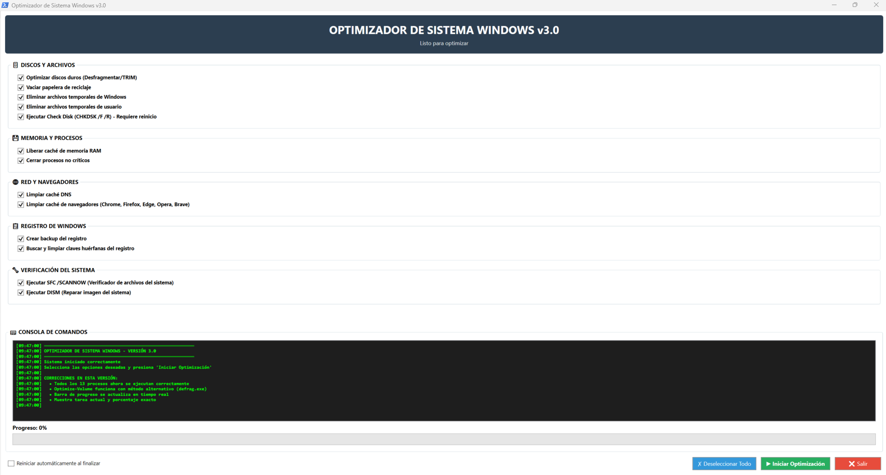

# 🧰 Optimizador de Sistema Windows v3.0  (Español)
**Script PowerShell con interfaz gráfica — `OptimizadorSistema_GUI.ps1`**

Este proyecto implementa un **optimizador avanzado para Windows**, desarrollado íntegramente en **PowerShell** y utilizando una interfaz gráfica basada en **WPF/XAML**. Permite ejecutar tareas de mantenimiento, limpieza, verificación y optimización del sistema desde una única ventana, con barra de progreso en tiempo real y consola integrada.

---

## 📸 Vista previa de la interfaz



> *Captura proporcionada por el autor mostrando la ejecución real del script.*

---

## 🚀 Funcionalidades principales

### 🗄️ Discos y Archivos
- Optimización automática según tipo de disco:  
  - **SSD → TRIM**  
  - **HDD → Desfragmentación**
- Vaciar papelera de reciclaje en todas las unidades  
- Eliminar archivos temporales de Windows  
- Eliminar archivos temporales del usuario  
- Programar **CHKDSK /F /R** para el próximo reinicio  

### 💾 Memoria y Procesos
- Liberar caché de memoria RAM  
- Cerrar procesos no críticos (opcional)  

### 🌐 Red y Navegadores
- Limpiar caché DNS  
- Limpiar caché de navegadores (Chrome, Firefox, Edge, Opera, Brave)  

### 📋 Registro de Windows
- Crear copia de seguridad del registro  
- Buscar y limpiar claves huérfanas  

### 🔧 Verificación del Sistema
- Ejecutar **SFC /SCANNOW**  
- Ejecutar **DISM /RestoreHealth**  

### 📟 Consola integrada
- Registro detallado de cada acción  
- Timestamps automáticos  
- Indicador de progreso y tarea actual  

---

## 🖥️ Interfaz gráfica (GUI)

Construida en XAML, incluye:

- Estilos personalizados para botones, checkboxes y grupos  
- Scroll automático para listas largas  
- Consola estilo terminal con colores tipo PowerShell  
- Barra de progreso con porcentaje exacto  
- Opción de reinicio automático al finalizar  

---

## 🔐 Requisitos

- Windows 10/11  
- PowerShell 5.1 o superior  
- **Debe ejecutarse como Administrador**

El script valida automáticamente los permisos:

> “Este programa requiere permisos de administrador. Por favor, ejecuta PowerShell como administrador y vuelve a intentarlo.”


---

## ▶️ Ejecución

1. Abrir PowerShell **como Administrador**  
2. Ejecutar el script:  
   ```powershell
   .\OptimizadorSistema_GUI.ps1


Muestra tarea actual y porcentaje exacto

> “Es posible que haya que cambiar la politica de ejecución de powershell. Ejecutar desde powershell:
>   ```powershell
>   set-executionpolicy -executionpolicy bypass -scope localmachine


---

# 🧰 Windows System Optimizer v3.0  (English)
**PowerShell Script with Graphical Interface — `OptimizadorSistema_GUI.ps1`**

This project provides an **advanced Windows optimization tool**, fully developed in **PowerShell** and using a graphical interface built with **WPF/XAML**. It allows you to perform maintenance, cleanup, verification, and system optimization tasks from a single window, featuring a real‑time progress bar and an integrated console.

---

## 📸 Interface Preview


> *Screenshot provided by the author showing the script running in real conditions.*

---

## 🚀 Main Features

### 🗄️ Disks and Files
- Automatic optimization based on disk type:  
  - **SSD → TRIM**  
  - **HDD → Defragmentation**
- Empty the recycle bin on all drives  
- Delete Windows temporary files  
- Delete user temporary files  
- Schedule **CHKDSK /F /R** for the next reboot  

### 💾 Memory and Processes
- Clear RAM cache  
- Close non‑critical processes (optional)  

### 🌐 Network and Browsers
- Clear DNS cache  
- Clear browser cache (Chrome, Firefox, Edge, Opera, Brave)  

### 📋 Windows Registry
- Create a registry backup  
- Search and clean orphaned registry keys  

### 🔧 System Verification
- Run **SFC /SCANNOW**  
- Run **DISM /RestoreHealth**  

### 📟 Integrated Console
- Detailed log of every action  
- Automatic timestamps  
- Display of current task and progress  

---

## 🖥️ Graphical Interface (GUI)

Built using XAML, featuring:

- Custom styles for buttons, checkboxes, and group boxes  
- Auto‑scroll for long lists  
- Terminal‑style console with PowerShell‑like colors  
- Progress bar with exact percentage  
- Optional automatic restart when finished  

---

## 🔐 Requirements

- Windows 10/11  
- PowerShell 5.1 or later  
- **Must be run as Administrator**

The script automatically checks for permissions:

> “This program requires administrator privileges. Please run PowerShell as administrator and try again.”

---

## ▶️ How to Run

1. Open PowerShell **as Administrator**  
2. Execute the script:  
   ```powershell
   .\OptimizadorSistema_GUI.ps1

